# Kurbenetes 101
<span style="color:red">_V texte sa môžu nachádzať preklepy a gramatické chyby. Dávid bol korektor textu a odobril jeho publikáciu_</span>.
## Intro

### Container
* Kontajner je ľahký a samostatný spustiteľný balík, ktorý zahŕňa všetko potrebné na spustenie časti softvéru, vrátane kódu, bežného prostredia, systémových nástrojov, systémových knižníc a nastavení.
* Kontajnery poskytujú izolované a konzistentné prostredie pre aplikácie. Zabezpečujú , že bežia rovnakým spôsobom na rôznych systémoch a prostrediach.
* Kontajnery sú abstrakciou na úrovni aplikácie, ktorá vám umožňuje balíčkovať a spúšťať aplikáciu a jej závislosti ako jednotnú jednotku.

#### _Docker_
* _Docker je konkrétna platforma a sada nástrojov na vytváranie, nasadzovanie a správu kontajnerov._

### Orchestration
* Orchestrácia je koordinácia a správa viacerých počítačových systémov, aplikácií a/alebo služieb, ktorá spája viacero úloh do väčšieho pracovného postupu alebo procesu.

### Container Orchestration
* Kubernetes orchestrácia umožňuje vytvárať aplikácie, ktoré sa rozprestierajú(_obsahujú_) viacero kontajnerov, plánovať kontajnery napriek(_cez_) cluster, škálovať tieto kontajnery a spravovať ich stav

* Kuberneter eliminuje mnoho manuálnych procesov spojených s nasadzovaním a škálovaním kontajnerizovaných aplikácií. Umožňuje zoskupiť(_cluster_) skupiny hostov, buď fyzické alebo virtuálne mašiny, bežiace(_running_) Linux kontajnery. A Kubernetes dáva platformu na jednoduchú a efektívnu správu týchto clusterov.

## Kubernetes
### Kubernetes Main Components
* __Cluster:__ Obsahuje kontrolný panel(Control plane), virtuálne mašiny alebo nody.
* __Control plane:__ Kolekcia procesov, ktoré kontrolujú nody v Kubernetese. Odtiaľto pochádzajú všetky úlohy. Vrstva orchestrácie kontajnerov, ktorá vystavuje rozhranie API a rozhrania na definovanie, nasadenie a spravovanie životného cyklu kontajnerov.
* __Kubelet:__ Tento servis beží na nodoch, číta manifesty kontajnerov a zaručuje, že definované kontajnery sú spustené a bežiace.
* __[Pod](#pod):__ Skupina jedného alebo viacerých kontajnerov nasadených v jednom node. Všetky kontajnery v pode zdieľajú IP adresu, IPC, hostname a ostatné zdroje(resources). 

## Architektura
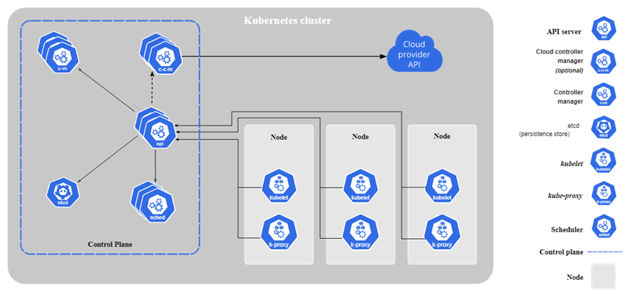
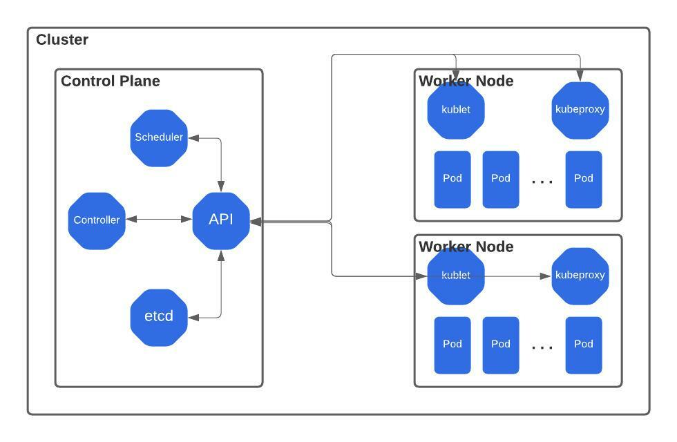

### kubectl
* CLI nástroj na komunikáciu s Kubernetes API(_Kubernetes cluster's control plane_) 
* [Detailná dokumentácia](https://kubernetes.io/docs/reference/kubectl/)

### Kubectl - grafická alternatíva
Alternatívne grafické nástroje
* K9s
  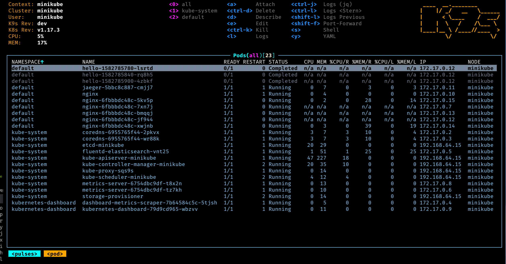
* LENS
  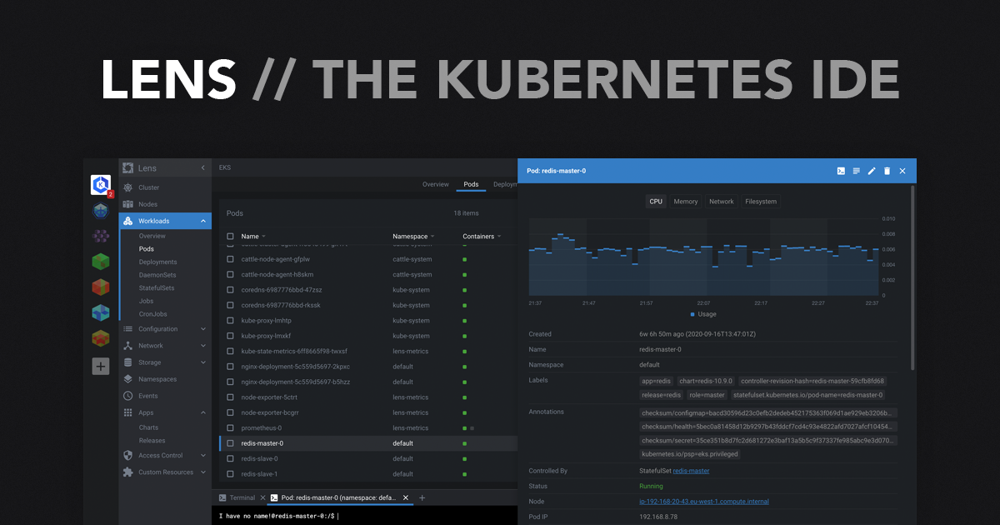

### Imperatívny vs Deklaratívny prístup
* __Imperatívny__
  * Commandy získavajú okamžitú platnosť
  * V commande špecifikuješ priamo chcený stav
  * Využívajú sa väčšinou na rýchle tasky a debugging

  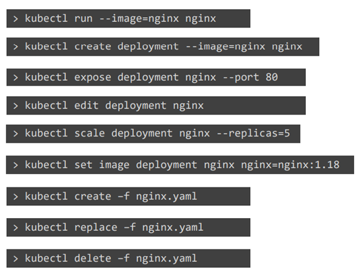
* __Deklaratívny__
  * Deklarujeme chcené stavy Kurbernetes prvkov do konfiguračného súboru(_YAML_) a následne použiť danú konfiguráciu na cluster
  
  

### YAML
* Štruktúra Kubernetes templatov
* Obsahuje:
  * apiVersion
  * kind
  * metadata
  * spec
```Yaml
apiVersion: v1
kind: Pod
metadata: 
  name: my-pod
  labels:
    app: myapp
    type: front-end
spec:
  containers:
  - name: nginx-container
    type: nginx
```

### Pod
* Pody sú najmenšia nasaditeľná aplikačná jednotka, ktorú vieš vytvoriť a spravovať v Kubernetese
* Pod je skupina(groupa) jedného alebo viacerých kontajnerov so zdielaným úložiskom(storage), sieťovými zdrojmi(network resources) a špecifikáciou ako spúšťať tieto kontajnery 
* [Podrobná dokumentácia](https://kubernetes.io/docs/concepts/workloads/pods/)
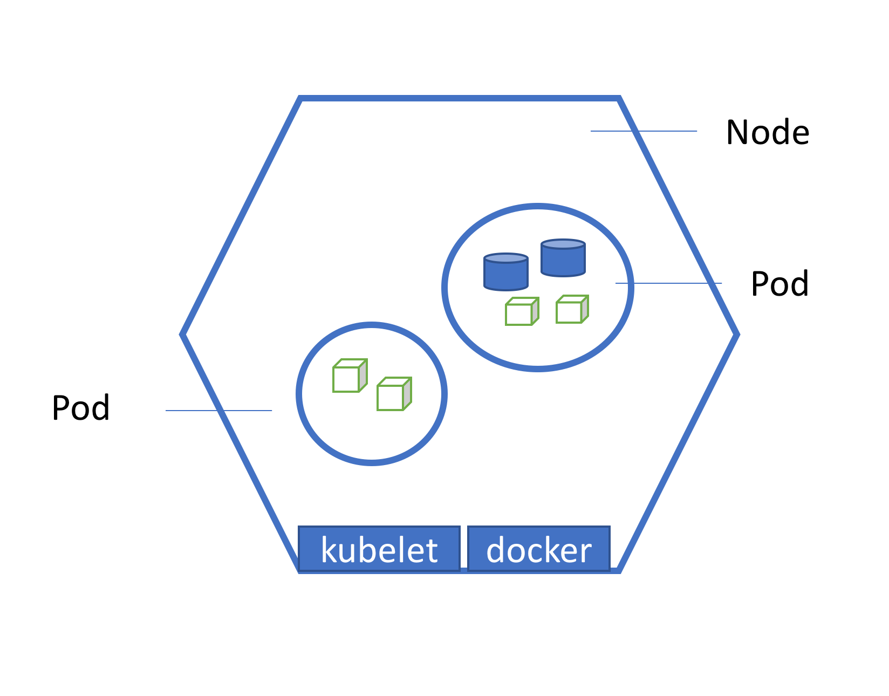

#### Pod sidecar
* Pod sidecar je navrhový vzor, kde sa nasadí dodatočný kontajner(sidecar container) popri hlavnom aplikačnom kontajneri v tom istom Kubernetes Pode.
* Sidecar je zodpovedný za spúštanie doplňujúcich procesov alebo poskytovanie podporných služieb hlavnému aplikačnému kontajneru.
* Tento vzor sa často používa na rozšírenie funkčnosti alebo správu určitých aspektov hlavného kontajneru bez priamej úpravy jeho kódu alebo správania.

  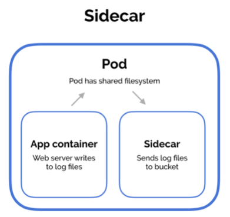

### ReplicaSet & Deployment
#### ReplicaSet
* [Dokumentácia](https://kubernetes.io/docs/concepts/workloads/controllers/replicaset/)
* Definuje počet kópii podov, ktoré majú byť spustené v k8s

```yaml
apiVersion: apps/v1
kind: ReplicaSet
metadata:
  name: myapp-deployment
  labels:
    app: myapp
    type: front-end
spec:
  template:
    metadata:
      name: myapp-pod
      labels:
        app: myapp
        type: front-end
    spec:
      containers:
      - name: nginx-container
        image: nginx
replicas: 3
selector:
  matchLabels:
    type: front-end
```
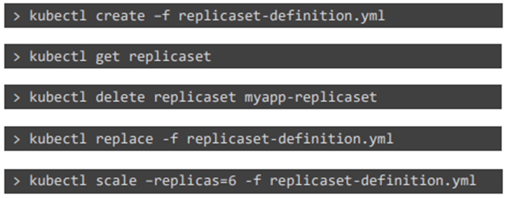
#### Deployment
[Dokumentácia](https://kubernetes.io/docs/concepts/workloads/controllers/deployment/)

Je to nadmnožina ReplicaSet-u
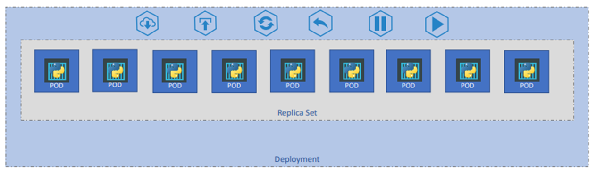
Vykonáva:
* Upgrades
* Rollout
* Rollbacks

**Stratégia nasadenia**
* Recreate
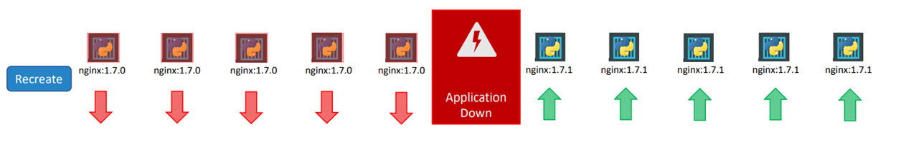
* Rolling Update
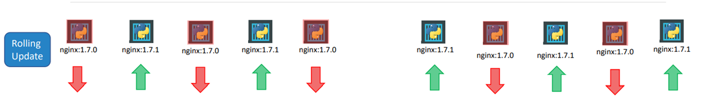

**Rollbacks**
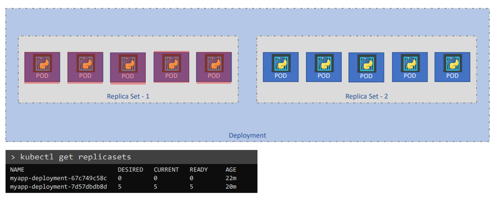
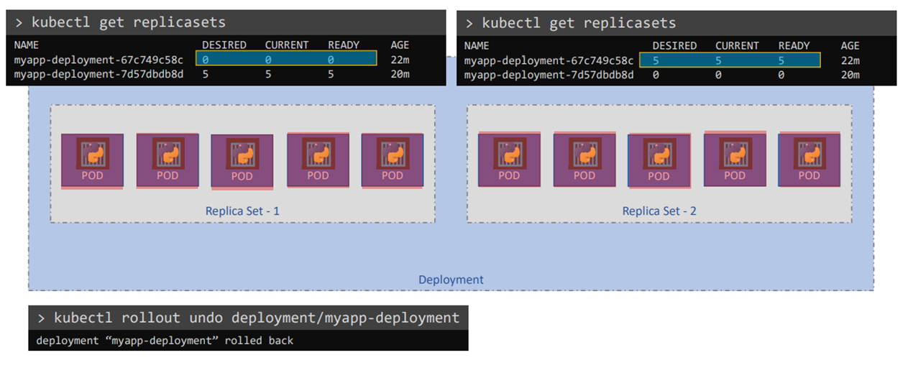

### Services
Pomocou služby je umožnený prístup k rozhraniu podu zo sieťového prostredia.
[Dokumentácia](https://kubernetes.io/docs/concepts/services-networking/service/).

Typy služieb, ktoré kubernetes poskytuje:
* NodePort
  * Kubernetes NodePort je typ služby, ktorá umožňuje exponovať skupinu podov do vonkajšiej siete.
  * Pri vytvorení služby NodePort sa pridelí statický port na každom node vo Kubernetes clustery.
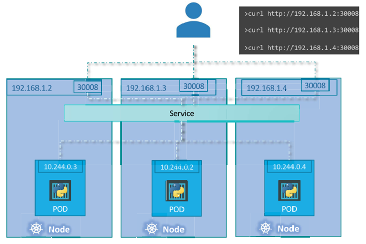
* ClusterIP
  * Kubernetes ClusterIP je typ služby, ktorá exponuje skupinu kontajnerov výhradne vo vnútri clustera. 
  * **Neexponuje ich do vonkajšieho siete.** 
  * Pri vytvorení ClusterIP sa priradí stabilná vnútorná IP adresa tejto služby, ktorú môžu využívať iné služby v rámci Kubernetes clustera na prístup ku kontajnerom.
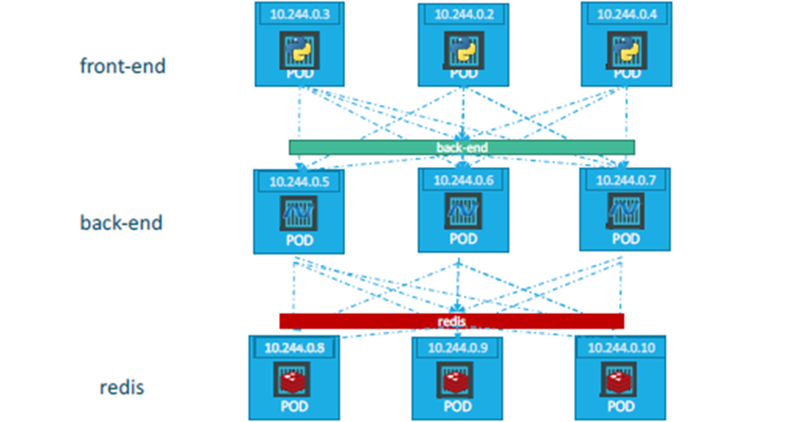
* LoadBalancer
  * Využíva sa v cloud prostredí
    * Azure, AWS, Google
  * LoadBalancer ako sluźba je poskytnutá samotným cloud providerom a on sa postará ako je výkon(load) balancovaný na jednotlivé pody

### Namespaces
* [Dokumentácia](https://kubernetes.io/docs/concepts/overview/working-with-objects/namespaces/)
* Namespaces poskytujú mechanizmus pre izoláciu skupín zdrojov v rámci jedného clustra.
* Namespaces sú spôsob ako organizovať clustre do virtuálnych sub-clustrov.
*  Každý zdroj, ktorý existuje v Kubernetes, existuje buď v predvolenom namespace alebo v namespace, ktorý vytvoril operátor clustra.
* Kubernetes automaticky ponúka 3 typy:
  1. **default:** Pokiaľ nie je vytvorený iný namespace celý cluster sa nachádza v tomto
  2. **kube-system:** Využíva sa na Kubernetes komponenty
  3. **kube-public:** Využíva sa na public resources

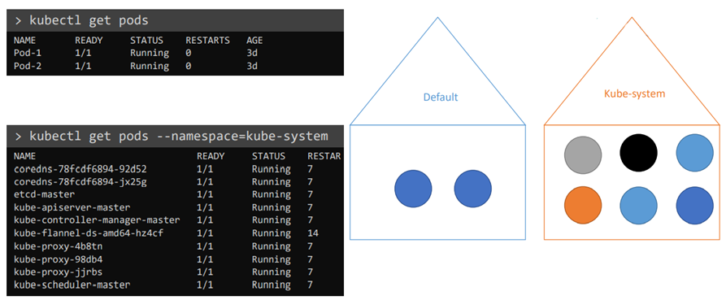

#### Vytvorenie
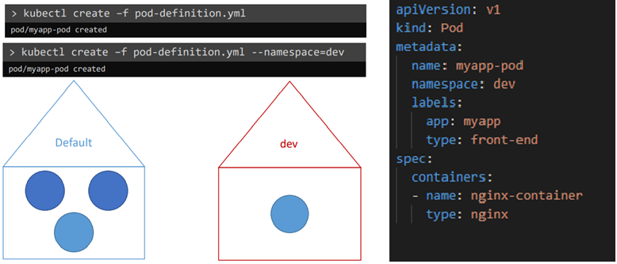

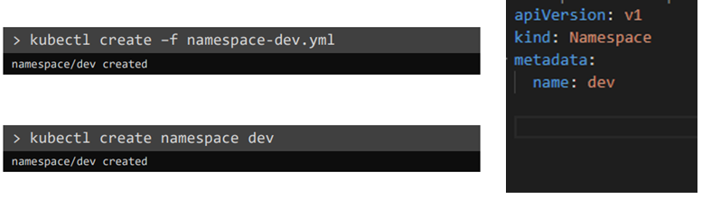

#### Switching (Prepínanie)
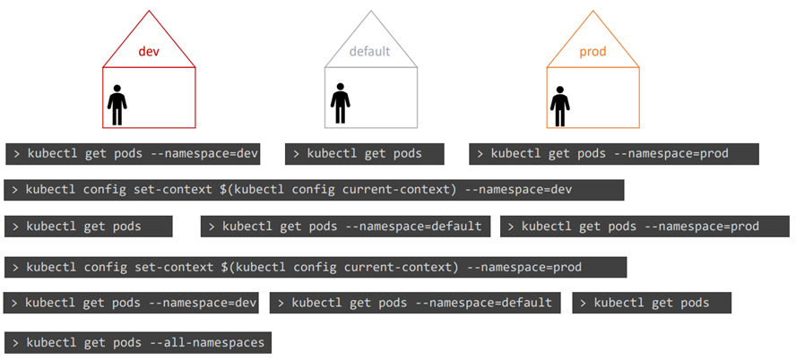

### Storage
[Dokumentácia](https://kubernetes.io/docs/concepts/storage/)
#### Volumes
* [Dokumentácia](https://kubernetes.io/docs/concepts/storage/volumes/)
* Spôsob, ako ukladať dáta, ktoré pretrvávajú aj po ukončení kontajnerov. (_Súbory na disku v kontajneri sú dočasné_)

* Dva typy úložísk:
  1. Ephemeral Volumes (Dočasné zväzky)
     * [Dokumentácia](https://kubernetes.io/docs/concepts/storage/ephemeral-volumes/)
     * Tieto zväzky sú základnou jednotkou úložiska v Kubernetes.
  2. Persistent Volumes (Trvalé zväzky)
     * [Dokumentácia](https://kubernetes.io/docs/concepts/storage/persistent-volumes/)
     * Tieto zväzky sú určené na dlhodobé ukladanie dát. 
     * Sú navrhnuté tak, aby oddelili úložisko od podu a umožnili jeho opätovné použitie.


### Configmaps & Secrets
#### Configmaps
* Slúžia na "vytiahnutie" konfiuguračných parametrov mimo definície podu

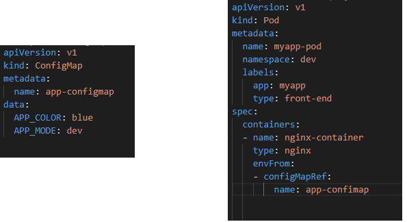
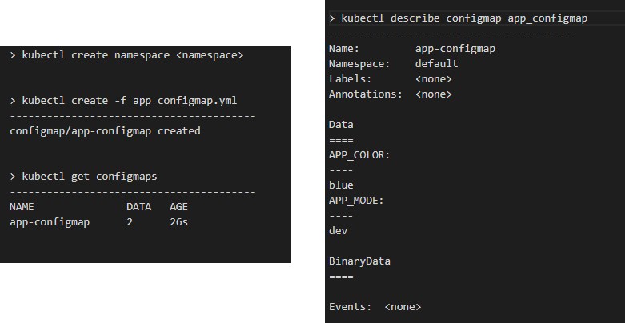

#### Secrets
* Podobne ako Configmaps ale umožňujú ukladať údaje v hashovanej forme

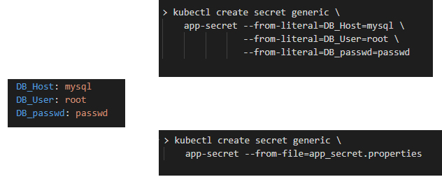

* 

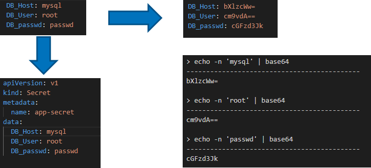

* 

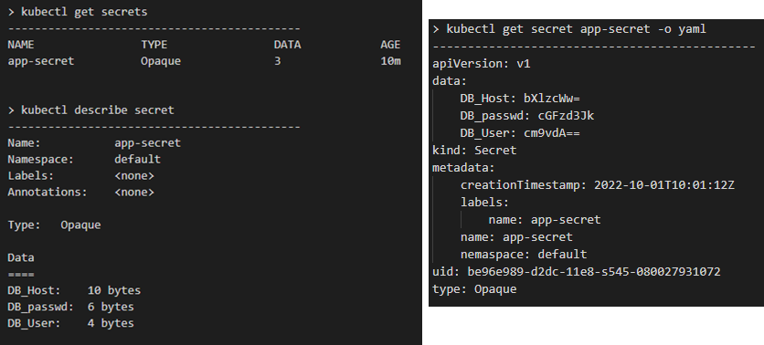

* 

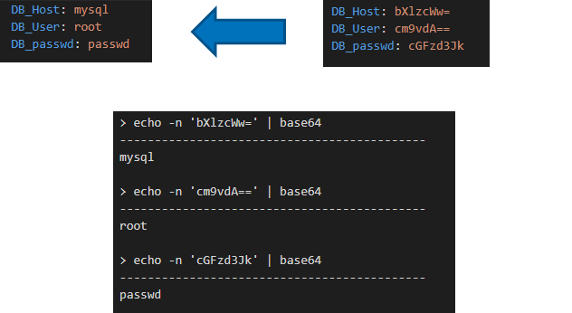

* 

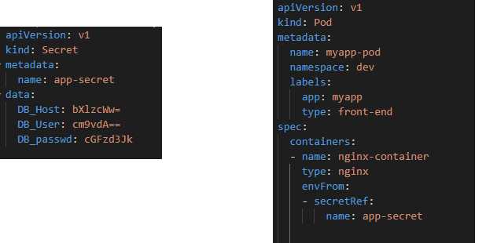
### Škálovateľnosť

#### Horizontal Pod Autoscaler - hpa
* Na základe metrík mení hodnotu "Replicas" v deploymente
#### Cluster Autoscaler - ec2(VMs)
* Pripája nové worker nody do k8s
#### Descheduler
* Kontrola zníženia výkonu
* Ak hpa zníži počet potrebných replík => descheduler môže znížiť počet VMs
* Descheduler kontroluje možnosť presunu podov na iný worker => descheduler môže znížiť počet VMs

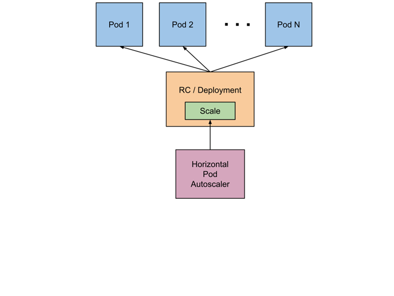
